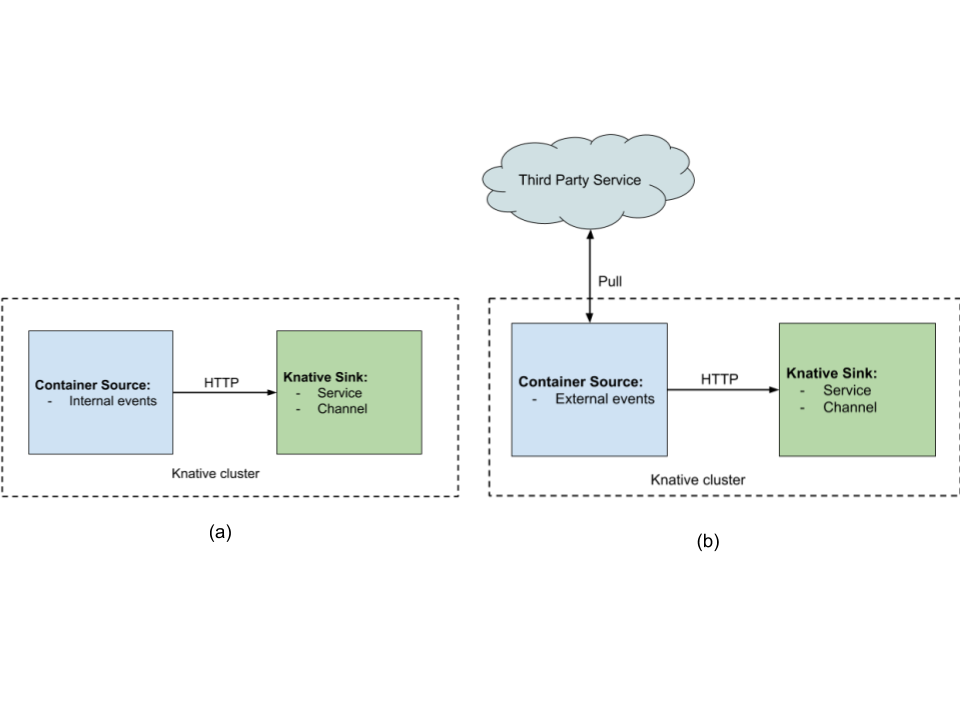

## How To Write Knative Container Sources

[Container Sources](https://github.com/knative/docs/tree/master/eventing#containersource) as mentioned in the official documentation:

> ... instantiate a container image which can generate events until the ContainerSource is deleted. This may be used (for example) to poll an FTP server for new files or generate events at a set time interval.

These types of event sources are described in so-called `ContainerSource` object manifest (e.g [`manifest.yaml`](./bash/manifest.yaml)) and can be deployed to your Knative cluster with the single command `kubectl apply -f manifest.yaml`.

This repository contains a collection of Container sources for knative eventing. They are meant to be an introduction to writing event sources.

In this repository will use the term _Container Source_ to describe a Knative event source of the kind `ContainerSource`.

## Concepts

A container source generates events and forwards those events to an event receiver called a _sink_.

There are two types of container sources depicted in the diagram below.

a) Container sources that generate events in an autonomous manner (e.g Task that runs at a regular interval)

b) Container sources that pull events from a third-party event provider (e.g Google PubSub, Weather service)



Event sources that need a publicy accessible endpoint (i.e WebHook) tend to be written using a Kubernetes controller (see this [tutorial](https://github.com/knative/docs/blob/master/eventing/samples/writing-a-source/README.md))

A _sink_ receives the events sent by the container source. In the context of Function as a Service, you can think of a _sink_ as a function, but it could be something else.

## Specification

Container Sources are custom Kubernetes objects. A well configured Knative cluster will have the `ContainerSource` Custom Resource Definition pre-defined and you will be able to create custom objects of the `Kind` `ContainerSource`.

A sample manifest is shown below. Like most Kubernetes objects it has an `apiVersion`, a `kind`, some `metadata` with a mandatory name and a spec. The specification of a Container Source is fully described in the [API](https://github.com/knative/eventing-sources/blob/master/pkg/apis/sources/v1alpha1/containersource_types.go
) but in its simplest form contains a container _image_ (which once running will generate or pull the events) and a _sink_ which is the event receiver.

```yaml
apiVersion: sources.eventing.knative.dev/v1alpha1
kind: ContainerSource
metadata:
  name: bashsample
spec:
  image: gcr.io/triggermesh/bash
  sink:
    apiVersion: eventing.knative.dev/v1alpha1
    kind: Channel
    name: default
```

### Version

The specification is still `v1alpha1` and may change. In addition to the image name and the sink, you can also define a set of environment variables, some arguments to the container and a service account name.

## How-to write a Container Source

### Generating events

To generate event you will write code in the language of your choice. The events will then be sent over HTTP to the URL of the _sink_

The URL of the _sink_ can be obtained as an environment variable, therefore a short example of an event generation bash script `event.sh` could be:

```shell
#!/bin/bash

set -ex

while true; do
    curl -XPOST -H 'Content-type: application/cloudevents+json' -d '{"Hello":"World"}' ${SINK}
    sleep 60
done
```

### Containerization

The code generating events needs to be containerized so it can be referenced by a Docker image in the Container Source manifest.

A short `Dockerfile` for the previous script would be:

```
FROM debian:7-slim

RUN apt-get update && \
    apt-get install -y curl

ADD event.sh /event.sh

ENTRYPOINT ["/event.sh"]
```

## Technical Tips

The Knative event controller which handles Container Sources handles the destination for events using the `sink` object referenced in the manifest. This sink is automatically discovered and referenced as an argument to the container *and* as an environment variable.

This leads to two technical details

- Use ENTRYPOINT and not CMD in your Dockerfile, otherwise the `--sink` will be parsed as an executable and not an argument
- You can use the environment variable SINK which gives you the address of the sink defined in the manifest


## Testing tips

Use the `message-dumper` as an event receiver. This is a knative service which dumps the incoming events to stdout.

You can create it with:

```
kubectl apply -f https://github.com/knative/eventing-sources/releases/download/v0.3.0/message-dumper.yaml
```

## CloudEvents specification

The Cloud Native Computing Foundation [CNCF](https://cncf.io) through its serverless working group has developed a specification for [Cloud Events](https://cloudevents.io/).

The previous sample how-to showed an event as a pure JSON object, sources in this repository also show how to format a CloudEvent and use this specification to send events from the Container source to the sink.

## Collection Samples

Each directory showcases the use of a different language as well as different ways to send events.

Each directory contains a `Dockerfile` to build the event source container image

Each directory contains a `manifest.yaml` manifest to deploy the event source

* [bash](./bash)
* [bash with cloudevents](./bash-ce)
* [python](./python)

## Support

We would love your feedback on this tool so don't hesitate to let us know what is wrong and how we could improve it, just file an [issue](https://github.com/sebgoa/ksources/issues/new)

## Code of Conduct

This plugin is by no means part of [CNCF](https://www.cncf.io/) but we abide by its [code of conduct](https://github.com/cncf/foundation/blob/master/code-of-conduct.md)
